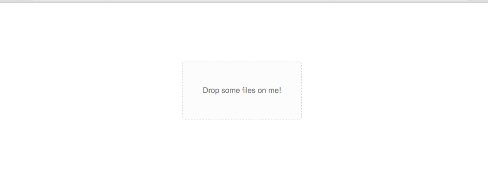

# Magic Dropzone



## Usage

Import `MagicDropzone` in your React component:

```javascript static
import MagicDropzone from "react-magic-dropzone";
```

```jsx
onDrop = (accepted, rejected, links) => {
  // Have fun
};
```

```jsx
<MagicDropzone
  accept="image/jpeg, image/png, .jpg, .jpeg, .png"
  onDrop={this.onDrop}
>
  Drop some files on me!
</MagicDropzone>
```
